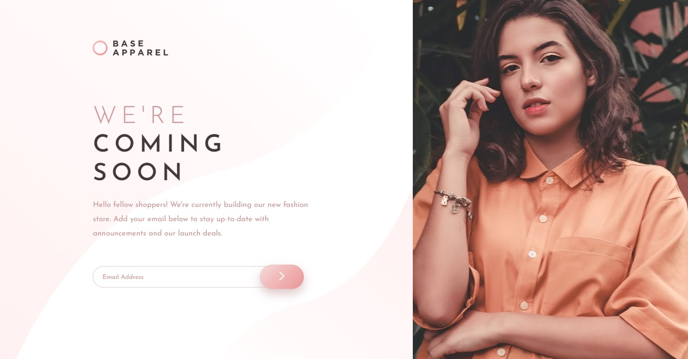
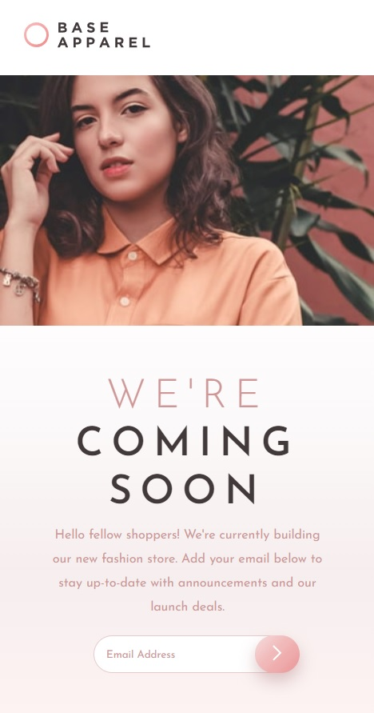

### 
Choose your language | Escolha seu idioma 

 

 

 

  

<h3 align="center">Base Apparel - coming soon</h3>

  

     A landing page of a store launching soon
  

  
  <a href="https://edilan-ribeiro.github.io/base-apparel-coming-soon-fmChallenge/">View Demo</a>

 

  
Table of Contents

  <ol>
    <li>
      <a href="#about-the-project">About The Project</a>
      <ul>
        <li><a href="#built-with">Built With</a></li>
        <li><a href="#highlights">Highlights</a></li>
        <li><a href="#challenges-and-lessons-learned">Challenges and lessons learned</a></li>
      </ul>
    </li>
    <li><a href="#contact">Contact</a></li>
  </ol>

  

## About The Project

 

The creation of this page was carried out to practice and enhance my frontend skills.  
A 'Coming Soon' page is an intriguing strategy that many companies adopt to ate anticipation and interest around a product, service, or project that will be launched in the future. It's like giving a glimpse of what's to come and leveraging people's curiosity to build an engaged audience right from the start.

 
Active states:

  

<strong>Mobile</strong>:

 

(<a href="#readme-top">back to top</a>)

### Built With

(<a href="#readme-top">back to top</a>)

## Highlights

 

This page was based on the frontendmentor challenge 
<a href="https://www.frontendmentor.io/challenges/base-apparel-coming-soon-page-5d46b47f8db8a7063f9331a0" target="_blank"> you can check out the challenge here.</a>

 

The highlights of this page:
- Responsive layout
- E-mail validation

Extras added beyond the challenge:
- Thank you message

(<a href="#readme-top">back to top</a>)

## Challenges and lessons learned

📏 Item positioning posed a separate challenge because the image lacks proper proportion. Hence, it's obligatory to position elements in relation to it, otherwise, the appearance will be distorted.

💡 Form handling, this marked one of my initial form validation experiences, hence proved to be quite challenging.

🚀 Going the extra mile, to complete the package, I added a thank-you message.

In summary, it was possible to learn and practice:
- CSS positioning relative to the viewport as a whole
- Form field validation
- Transition between form elements

## Contact

💌 To send me a message, just use one of the buttons below! 

  
   
  

(<a href="#readme-top">back to top</a>)

